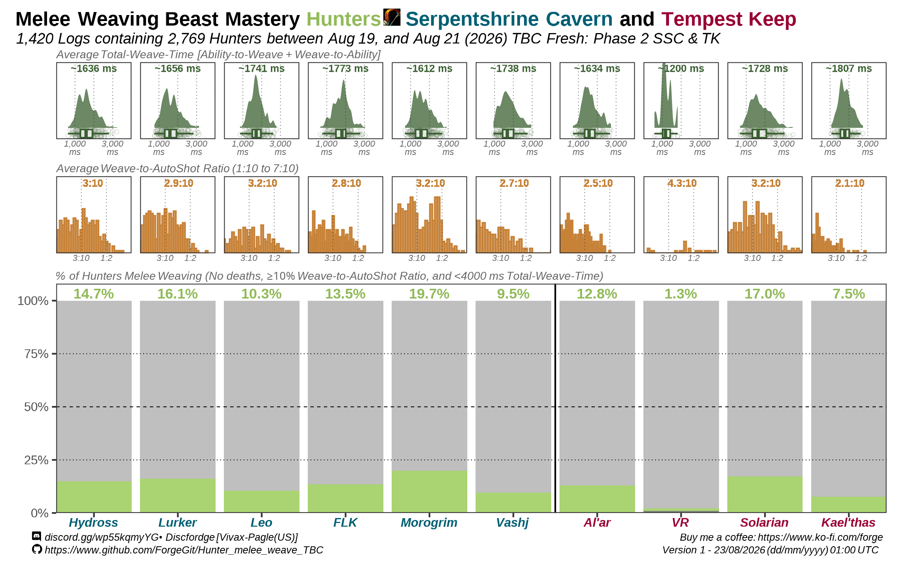

# ⚔️Melee Weaving Hunters⚔️
### _Data for World of Warcraft: The Burning Crusade Classic Anniversary - Phase 2_

_Vivax (Pagle-US) -_ `Discfordge` _(Discord)_

The Melee Weaving rotation has been described as a substantial DPS increase that can net ["upwards of 10% increased dps when played to perfection"](https://www.wowhead.com/tbc/guide/classes/hunter/dps-rotation-cooldowns-abilities-pve#dps-scenarios-2-2-1-melee-weaving-single-target) for Hunters playing in The Burning Crusade (TBC). 

Here I describe how many Hunters in _TBC: Fresh_ were Melee-Weaving between August 19, 2026 and August 21, 2026.

### Results

  

### Acknowledgments
Thanks to `joosy` _(Discord)_ from Hunter Discord for providing feedback on this analysis.

Thanks to `henry3281` _(Discord)_ for the tool used to measure and detect Melee Weaving in logs: https://aerthax.github.io/weave-delay/

## Other analysis and random stuff

- If you have questions, you can contact me on discord: https://discord.gg/wp55kqmyYG (Discord: Discfordge)  
- Or check Hunter Discord for further questions: https://discord.gg/8TVHxRr

- Consider buying me a coffee? :) https://ko-fi.com/forge

- Or check other things I have done here: https://github.com/ForgeGit?tab=repositories
